<!-- ============================================================
  GITHUB PROFILE README — Anurag Singh (@AnuragRoque)
  Design system: black / red (#ff2f3f) / steel — matches assets/neural-header.svg
  All stat widgets use custom colors (bg 07080a, accent ff2f3f) — no stock themes.
============================================================ -->

<!-- ====== HEADER: custom animated neural SVG (human × machine) ====== -->

<!-- ====== CONTACT BUTTONS (custom SVG, brand colors) ====== -->

  &nbsp;
  &nbsp;
  &nbsp;
  

<!-- ====== VISITOR COUNTER + FOLLOWERS ====== -->

  <!--  -->
  <!--  -->

 

<!-- ====== IDENTITY CARD — compressed on purpose ====== -->
##  Identity card

<!-- Deliberately NOT a table: GitHub forces borders on table cells.
     A plain list keeps real selectable text with zero borders. -->
 &nbsp;**Role:** AI & Data Engineer — production LLM systems, **solo, end to end**

 &nbsp;**Focus:** RAG · local/private AI · agentic AI (MCP) · OCR & data automation

 &nbsp;**Record:** **2+ yrs** shipping production AI · **5 enterprise platforms** built solo · **100+ daily users** · **200K+ transactions/month**

 &nbsp;**Creed:** **100% on-premise** — client data never leaves client infrastructure

 &nbsp;**Security:** Multi-tenant RBAC · guardrails · prompt-injection filtering

 &nbsp;**Base:** Gurugram, India · remote & hybrid friendly

 &nbsp;**Now:** Evolving **Stratum** & **Excellia** · LLM evals · agent orchestration

 

<!-- ====== FEATURED WORK ====== -->
##  Featured work
<!-- 

  
  

  
  

 -->

| System | Mission | Stack | Status |
|---|---|---|:---:|
| &nbsp;[**Stratum**](https://github.com/AnuragRoque/Enterprise-RAG-Platform) Enterprise&nbsp;RAG | Answers **strictly from your documents** — hybrid retrieval → RRF → cross-encoder → MMR → grounded refusal; tenant isolation in SQL | Python · FastAPI · pgvector · Ollama |  |
| &nbsp;[**Excellia&nbsp;AI**](https://github.com/AnuragRoque/Excellia-AI) Data&nbsp;intelligence | Air-gapped spreadsheet intelligence — **500K-row files**, evidence-backed answers; **19-tool MCP server** + Excel add-in + web + API | Python · pandas · scikit-learn · MCP |  |
| &nbsp;[**Fillo&nbsp;AI**](https://github.com/AnuragRoque/FilloAI-Extension) [Chrome&nbsp;Store](https://chromewebstore.google.com/detail/fnnlcgkmlimkadibaefjkfmpigollchk) | Fills any web form via **local LLM, zero cloud calls** — 9-layer field-intent engine; verify-then-write, never auto-submit | JS · Chrome MV3 · Ollama |  |
| &nbsp;[**KYC&nbsp;OCR**](https://github.com/AnuragRoque/KYC-Data-Automation-Tool) Document&nbsp;pipeline | Multi-doc OCR + **ML/LLM identity matching** (Aadhaar, PAN, GST) — used in real Paytm & OYO audits | Python · Google Vision · Tesseract |  |

>  **Closed-source @ TRPW:** Limestone (bank reconciliation — 10K+ tx/month, 32 hrs/week saved) · Betel TMS · Betel VMS · SOP Intelligence Portal

 

<!-- ====== TECH STACK — skillicons grid + everything else in one quiet line ====== -->
##  Tech stack

  

<!-- Brand-colored badges. ChromaDB / BM25 / Tesseract have no simple-icons logo,
     so their icons are hand-made SVGs embedded as base64 data URIs. -->

  
  
  
  
  
  
  
  
  
  
  

 

<!-- ====== GITHUB STATS — custom red/black to match the header ====== -->
##  GitHub stats

  <!--  -->
  

  

<!-- 

  
  

 -->

<!-- WakaTime: real hours coded per language. Requires a free wakatime.com account
     with the editor plugin installed. Shows an error card until the account exists —
     if your WakaTime username differs from AnuragRoque, change it here. -->
<!-- 

  

 -->

<!-- Profile details: join date, commit timeline, totals -->
<!-- 

  

 -->

<!-- Contribution heatmap — the classic year grid, recolored to profile red -->
<!-- 

  

 -->

<!-- Snake: generated daily by .github/workflows/snake.yml into the `output` branch.
     Broken image until the workflow has run once on GitHub (Actions tab → generate snake → Run workflow). -->
<!-- 

  

 -->

 

<!-- ====== CONNECT ====== -->
##  Let's connect

**Open to AI / Data Engineering roles & consulting** — RAG systems, document automation, data platforms.

 Gurugram, India ·  [anuragsingh2445@gmail.com](mailto:anuragsingh2445@gmail.com) ·  [linkedin.com/in/anurag2050](https://www.linkedin.com/in/anurag2050)

---

AI Engineer · Python Developer · LLMs · RAG · Local AI · NLP · OCR · Anurag Roque · Anurag Rogue · anuragroque

 Built by a human, assisted by machines — fittingly.

<!--
Anurag Singh · Anurag Roque · Anurag Rogue · anuragroque
AI Engineer · Data Engineer · Python · Machine Learning · LLM · RAG · Agentic AI · Ollama · Local LLM · FastAPI · Flask · PostgreSQL · pgvector · ChromaDB · Semantic Search · Hybrid Search · OCR · Tesseract · Google Vision · MCP · Model Context Protocol · Chrome Extension · Data Quality · KYC · Anomaly Detection
-->
